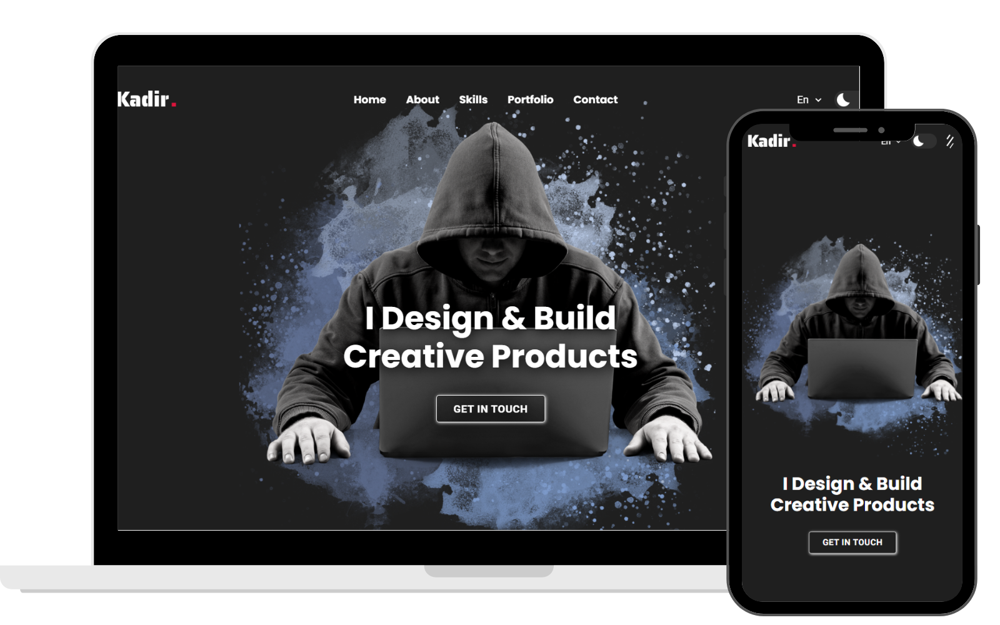

<h1 align="center">
  Template for Portfolio Website 
  <a href="https://kadiryazadzhi.github.io/portfolio/" target="_blank">KadirYazadzhi</a>
</h1>

  

 

  
 &nbsp;
 &nbsp;
 &nbsp;
 &nbsp;

<h3 align="center">
    🔹
    <a href="https://kadiryazadzhi.github.io/portfolio/index.html#contact">Report Bug</a> &nbsp; &nbsp;
    🔹
    <a href="https://kadiryazadzhi.github.io/portfolio/index.html#contact">Request Feature</a>
</h3>

## 📖 Introduction
I created a Template for a Portfolio Website that allows users to showcase their work and skills in a professional manner. The template features a clean, modern design and is fully responsive, ensuring it looks great on all devices. It includes sections for projects, skills, and contact information, making it easy for users to present their portfolio effectively.

## ✨Why do you need a portfolio? ☝️

- Professional way to showcase your work
- Increases your visibility and online presence
- Shows you’re more than just a resume

## 🔨 Built With
This project was built using these technologies:
- HTML5
- CSS3
- Javascript
- WebStorm

## 📚 Sections
- Home
- About
- Skills
- Portfolio
- Contact

## ⚡ Features
**📖 Animations**  

**🎨 Modern UI Design + Reveal Animations**  

**☀️  Light and Dark Mode Theme**  

**📱 Fully Responsive**  

**🌍 Multi Language version**

## ⚙️ Getting Started
Visit the following link to view: https://kadiryazadzhi.github.io/Portfolio_2/

## 🙏 Show your support
Give a ⭐️ if this project helped you! You can buy me a coffee if you'd like to support my work further.

